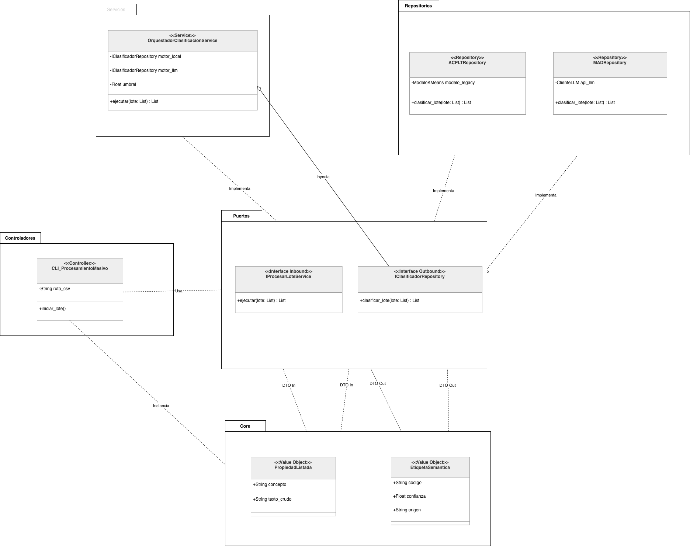

# 🚀 Framework Híbrido de Codificación Semántica
Este repositorio contiene el núcleo (Kernel) de un sistema de clasificación semántica híbrida. Diseñado bajo los principios de **Arquitectura Hexagonal (Puertos y Adaptadores)** y **Patrones de Diseño de Alta Cohesión**, el sistema permite la ejecución en cascada de múltiples motores de Inteligencia Artificial (Modelos Tradicionales + Agentes LLM) con un ruteo de decisión dinámico.

## 📌 Descripción General

El objetivo P0 de este framework es clasificar propiedades semánticas (texto crudo) asignándoles un código estandarizado. Para combatir las alucinaciones y la "fatiga de material" de los modelos individuales, el sistema implementa un **Pipeline con Fallback**:
1. Los datos pasan por un motor primario rápido y determinista (ej. kNN con Embeddings E5).
2. Si el nivel de confianza de la predicción no supera un umbral estricto, el dato es delegado al siguiente motor en la línea de defensa (ej. Debate Multi-Agente RAG).
3. Una "Política Maestra" (Router) evalúa los resultados en tiempo real sin acoplar la lógica matemática al orquestador central.

---

## 🏛️ Arquitectura del Sistema

El sistema es estrictamente agnóstico. El Orquestador no conoce la existencia de HuggingFace, OpenAI, LangChain ni matemáticas de cálculo de distancia. Todo se comunica a través de **Puertos (Interfaces)**.



### ⚙️ Componentes Principales

* **Core (Dominio):** Contiene los *Value Objects* inmutables. 
    * `PropiedadListada`: El input crudo.
    * `EtiquetaSemantica`: El DTO final de salida, que actúa como un "maletín" transportando el código asignado y las métricas de evaluación dinámicas.
* **Puertos (Aduana):** Contratos estrictos (`interfaces.py`). Definen el Inbound (`IProcesarLoteService`), el Outbound de los motores (`IClasificadorRepository`) y el Outbound de reglas (`IPoliticaAceptacion`).
* **Servicios (El Kernel):** El `OrquestadorClasificacionService`. Funciona como un director de orquesta ciego. Aplica el patrón de Pipeline iterando sobre los motores inyectados y delegando la decisión de aceptación a la Política Maestra.
* **Repositorios (Infraestructura):** Aquí vive el código "sucio". Adaptadores que envuelven los scripts legacy y las APIs de LLMs para que cumplan con el contrato de los Puertos.
* **Controladores (Interfaces de Usuario):** *(En desarrollo)* Scripts CLI o endpoints API que actúan como la piel del sistema, inyectando los datos iniciales al orquestador.

---

## ⚖️ El Sistema de Políticas (Router Design Pattern)

Para respetar el Principio Abierto/Cerrado (OCP de SOLID), la toma de decisiones no está cableada con `if/else` en el Orquestador. Se implementó un patrón **Registry / Composite Policy**:

1.  **Jueces Especialistas:** Clases puras (`PoliticaACPLT`, `PoliticaMAD`) que conocen los umbrales matemáticos de un motor específico (ej. Distancia Euclidiana < 0.15 o Ragas Relevance > 0.80).
2.  **Juez Supremo (Política Maestra):** Un enrutador dinámico que lee el origen del DTO y delega la validación al juez especialista correspondiente. Permite escalabilidad infinita de motores sin modificar el núcleo.

---

## 📂 Estructura de Directorios

```bash
📦 FrameworkHibridoCodificacion
 ┣ 📂 src
 ┃ ┣ 📂 core              # DTOs y Value Objects (Maletines de datos)
 ┃ ┃ ┣ 📜 __init__.py
 ┃ ┃ ┗ 📜 models.py
 ┃ ┣ 📂 puertos           # Interfaces y Contratos de arquitectura
 ┃ ┃ ┣ 📜 __init__.py
 ┃ ┃ ┗ 📜 interfaces.py
 ┃ ┣ 📂 servicios         # Lógica de negocio orquestada
 ┃ ┃ ┣ 📜 __init__.py
 ┃ ┃ ┗ 📜 orquestador.py
 ┃ ┣ 📂 repositorios      # Implementaciones concretas de IA y Reglas
 ┃ ┃ ┣ 📜 __init__.py
 ┃ ┃ ┗ 📜 politicas.py    # Router de políticas
 ┃ ┗ 📂 controladores     # [Pendiente] CLI y carga de CSVs
 ┗ 📜 README.md